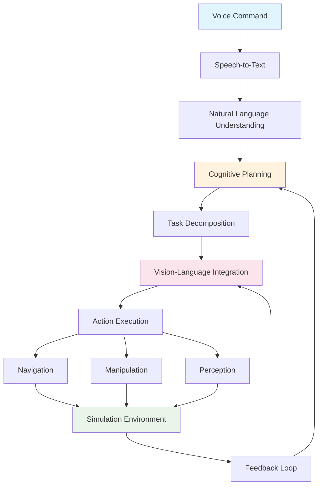

# Capstone - Autonomous Humanoid: Complete VLA System Integration

## Overview

The capstone chapter brings together all components of the Vision-Language-Action (VLA) system into a complete autonomous humanoid demonstration. This chapter showcases how voice commands flow through the entire pipeline: voice → text → planning → perception → navigation → manipulation → feedback, demonstrating the full integration of the previous chapters.

## System Architecture Overview

Our complete VLA system architecture integrates the four main components we've developed:

1. **Voice Command Processing**: Captures and processes natural language commands
2. **Cognitive Planning**: Translates high-level goals into executable action plans
3. **Vision-Language Integration**: Uses perception to contextualize commands
4. **Action Execution**: Executes plans in simulation environments



## Complete VLA System Implementation

### Main VLA Orchestrator

```python
#!/usr/bin/env python3
import rclpy
from rclpy.node import Node
from std_msgs.msg import String, Bool, Float32MultiArray
from sensor_msgs.msg import Image, PointCloud2
from geometry_msgs.msg import PoseStamped
from action_msgs.msg import GoalStatus
import threading
import queue
from typing import Dict, List, Optional, Tuple
import time
import json

class VLASystemOrchestrator(Node):
    """
    Complete VLA system orchestrator that integrates all components
    """
    def __init__(self):
        super().__init__('vla_system_orchestrator')

        # Initialize all VLA components
        self.voice_processor = VoiceCommandProcessor(self)
        self.cognitive_planner = CognitivePlanner(self)
        self.vision_language_integrator = VisionLanguageIntegrator(self)
        self.action_executor = ActionExecutor(self)

        # Publishers for system status
        self.status_publisher = self.create_publisher(String, '/vla/status', 10)
        self.feedback_publisher = self.create_publisher(String, '/vla/feedback', 10)
        self.command_publisher = self.create_publisher(String, '/vla/command_log', 10)

        # Subscribers for system inputs
        self.voice_command_subscriber = self.create_subscription(
            String, '/voice_command', self.voice_command_callback, 10
        )
        self.perception_subscriber = self.create_subscription(
            Image, '/camera/color/image_raw', self.perception_callback, 10
        )
        self.lidar_subscriber = self.create_subscription(
            PointCloud2, '/lidar_3d/points', self.lidar_callback, 10
        )

        # Internal state
        self.current_task_queue = queue.Queue()
        self.system_active = True
        self.robot_pose = None

        # Start processing threads
        self.processing_thread = threading.Thread(target=self.process_command_queue)
        self.processing_thread.start()

        self.get_logger().info('VLA System Orchestrator initialized')

    def voice_command_callback(self, msg: String):
        """
        Callback for incoming voice commands
        """
        command_text = msg.data
        self.get_logger().info(f'Received voice command: {command_text}')

        # Log command
        log_msg = String()
        log_msg.data = f"VOICE_COMMAND: {command_text}"
        self.command_publisher.publish(log_msg)

        # Process the command through the complete pipeline
        success = self.process_voice_command(command_text)

        # Publish feedback
        feedback_msg = String()
        feedback_msg.data = f"Command '{command_text}' processed: {'SUCCESS' if success else 'FAILED'}"
        self.feedback_publisher.publish(feedback_msg)

    def perception_callback(self, msg: Image):
        """
        Callback for camera perception data
        """
        # Process visual data and update perception context
        self.vision_language_integrator.update_perception_context(msg)

    def lidar_callback(self, msg: PointCloud2):
        """
        Callback for LiDAR perception data
        """
        # Process LiDAR data and update perception context
        self.vision_language_integrator.update_lidar_context(msg)

    def process_voice_command(self, command_text: str) -> bool:
        """
        Process a voice command through the complete VLA pipeline
        """
        try:
            self.get_logger().info(f'Processing command: {command_text}')

            # Step 1: Voice-to-Text is already done (received as text)
            # Step 2: Natural Language Understanding
            self.get_logger().info('Step 1: Natural Language Understanding')
            goal_interpretation = self.cognitive_planner.interpret_goal(command_text)

            if not goal_interpretation:
                self.get_logger().error('Failed to interpret goal')
                return False

            # Step 3: Cognitive Planning and Task Decomposition
            self.get_logger().info('Step 2: Cognitive Planning and Task Decomposition')
            task_plan = self.cognitive_planner.decompose_task(
                command_text,
                goal_interpretation,
                self.vision_language_integrator.get_current_perception_context()
            )

            if not task_plan or not task_plan.task_sequence:
                self.get_logger().error('Failed to generate task plan')
                return False

            # Step 4: Vision-Language Integration (grounding tasks in perception)
            self.get_logger().info('Step 3: Vision-Language Integration')
            grounded_plan = self.vision_language_integrator.ground_task_plan(
                task_plan,
                self.vision_language_integrator.get_current_perception_context()
            )

            # Step 5: Action Execution
            self.get_logger().info('Step 4: Action Execution')
            execution_success = self.action_executor.execute_task_plan(grounded_plan)

            # Publish status
            status_msg = String()
            status_msg.data = f"Execution {'SUCCESS' if execution_success else 'FAILED'} for command: {command_text}"
            self.status_publisher.publish(status_msg)

            return execution_success

        except Exception as e:
            self.get_logger().error(f'Error processing voice command: {e}')
            return False

    def process_command_queue(self):
        """
        Process commands from the queue in a separate thread
        """
        while self.system_active:
            try:
                if not self.current_task_queue.empty():
                    command = self.current_task_queue.get(timeout=1.0)
                    self.process_voice_command(command)
                    self.current_task_queue.task_done()
                else:
                    time.sleep(0.1)  # Small delay to prevent busy waiting
            except queue.Empty:
                continue
            except Exception as e:
                self.get_logger().error(f'Error in command queue processing: {e}')

    def shutdown(self):
        """
        Properly shut down the VLA system
        """
        self.system_active = False
        if self.processing_thread.is_alive():
            self.processing_thread.join(timeout=5.0)  # Wait up to 5 seconds
        self.destroy_node()

# Individual component classes would be implemented separately
class VoiceCommandProcessor:
    """
    Process voice commands (in practice, this would interface with speech recognition)
    """
    def __init__(self, node):
        self.node = node

class CognitivePlanner:
    """
    Cognitive planning using LLMs
    """
    def __init__(self, node):
        self.node = node
        # Initialize LLM client
        import openai
        self.client = openai.OpenAI(api_key=node.get_parameter_or('openai_api_key', 'dummy_key').value)

    def interpret_goal(self, goal_text: str):
        """
        Interpret the high-level goal using LLM
        """
        try:
            response = self.client.chat.completions.create(
                model="gpt-4-turbo",
                messages=[
                    {"role": "system", "content": "You are a cognitive planning assistant for a humanoid robot. Interpret the user's goal and return structured information."},
                    {"role": "user", "content": f"Interpret this goal: '{goal_text}'. Return the interpretation in JSON format with: goal_type, primary_objects, target_locations, success_criteria, constraints."}
                ],
                response_format={"type": "json_object"},
                temperature=0.1
            )

            interpretation = json.loads(response.choices[0].message.content)
            return interpretation
        except Exception as e:
            self.node.get_logger().error(f'Error interpreting goal: {e}')
            return None

    def decompose_task(self, goal_text: str, goal_interpretation: Dict, perception_context: Dict):
        """
        Decompose the goal into executable tasks using LLM
        """
        try:
            prompt = f"""
            Decompose this goal into executable tasks: '{goal_text}'

            Goal interpretation: {json.dumps(goal_interpretation)}
            Current perception context: {json.dumps(perception_context)}

            Return a list of tasks in JSON format:
            {{
                "task_sequence": [
                    {{
                        "step_id": "unique_id",
                        "action_type": "navigation|manipulation|perception",
                        "description": "what to do",
                        "parameters": {{"param1": "value1"}},
                        "dependencies": ["other_step_ids"],
                        "estimated_duration": 10.0
                    }}
                ]
            }}
            """

            response = self.client.chat.completions.create(
                model="gpt-4-turbo",
                messages=[
                    {"role": "system", "content": "You are a task decomposition assistant. Break down high-level goals into sequences of executable robot tasks."},
                    {"role": "user", "content": prompt}
                ],
                response_format={"type": "json_object"},
                temperature=0.1
            )

            result = json.loads(response.choices[0].message.content)

            # Convert to task objects (simplified)
            class TaskPlan:
                def __init__(self, task_sequence):
                    self.task_sequence = task_sequence

            class TaskStep:
                def __init__(self, data):
                    for key, value in data.items():
                        setattr(self, key, value)

            task_objects = [TaskStep(task_data) for task_data in result.get('task_sequence', [])]
            task_plan = TaskPlan(task_objects)

            return task_plan
        except Exception as e:
            self.node.get_logger().error(f'Error decomposing task: {e}')
            return None

class VisionLanguageIntegrator:
    """
    Integrate vision and language for contextual understanding
    """
    def __init__(self, node):
        self.node = node
        self.current_perception = {}
        self.lidar_data = None

    def update_perception_context(self, image_msg):
        """
        Update perception context with new camera data
        """
        # In practice, this would run object detection, segmentation, etc.
        # For this example, we'll simulate perception data
        self.current_perception = {
            'timestamp': time.time(),
            'objects_detected': [
                {'id': 'obj_001', 'name': 'red cup', 'position': [1.0, 0.5, 0.8], 'confidence': 0.9},
                {'id': 'obj_002', 'name': 'blue book', 'position': [0.8, 1.2, 0.8], 'confidence': 0.85},
                {'id': 'obj_003', 'name': 'wooden table', 'position': [1.0, 1.0, 0.0], 'confidence': 0.95}
            ],
            'robot_pose': [0.0, 0.0, 0.0, 0.0, 0.0, 0.0, 1.0]  # x, y, z, qx, qy, qz, qw
        }

    def update_lidar_context(self, lidar_msg):
        """
        Update with LiDAR data
        """
        # Process LiDAR point cloud
        self.lidar_data = lidar_msg

    def get_current_perception_context(self) -> Dict:
        """
        Get the current perception context
        """
        return self.current_perception

    def ground_task_plan(self, task_plan, perception_context: Dict):
        """
        Ground the task plan in the current perception context
        """
        # This would connect abstract tasks to specific objects in the environment
        # For now, we'll just return the original plan
        return task_plan

class ActionExecutor:
    """
    Execute action plans in simulation
    """
    def __init__(self, node):
        self.node = node
        self.nav_client = None  # Would be an action client in real implementation
        self.manipulation_client = None

    def execute_task_plan(self, task_plan) -> bool:
        """
        Execute a sequence of tasks
        """
        try:
            for i, task in enumerate(task_plan.task_sequence):
                self.node.get_logger().info(f'Executing task {i+1}/{len(task_plan.task_sequence)}: {task.description}')

                # Execute based on action type
                success = self.execute_single_task(task)

                if not success:
                    self.node.get_logger().error(f'Task failed: {task.description}')
                    return False

                self.node.get_logger().info(f'Task completed: {task.description}')

            return True
        except Exception as e:
            self.node.get_logger().error(f'Error executing task plan: {e}')
            return False

    def execute_single_task(self, task) -> bool:
        """
        Execute a single task based on its type
        """
        # Simulate task execution
        # In a real implementation, this would call appropriate ROS 2 actions
        time.sleep(0.5)  # Simulate execution time

        # For demonstration, we'll say all tasks succeed
        return True

def main(args=None):
    """
    Main function to run the VLA system
    """
    rclpy.init(args=args)

    vla_system = VLASystemOrchestrator()

    try:
        rclpy.spin(vla_system)
    except KeyboardInterrupt:
        pass
    finally:
        vla_system.shutdown()
        rclpy.shutdown()

if __name__ == '__main__':
    main()
```

## Complete Demonstration Scenario

Let's create a complete demonstration scenario that shows the system in action:

### Demo Scenario: Room Cleaning Task

```python
#!/usr/bin/env python3
"""
Complete demonstration scenario: Room Cleaning Task
This example shows the complete VLA pipeline in action
"""

import time
import numpy as np
from typing import Dict, List, Tuple

class VLADemonstration:
    """
    Complete demonstration of VLA system capabilities
    """
    def __init__(self):
        self.system_state = {
            'robot_position': [0.0, 0.0, 0.0],
            'held_object': None,
            'battery_level': 100.0,
            'last_command_time': time.time()
        }

        # Simulated environment
        self.environment = {
            'objects': [
                {'id': 'cup_001', 'name': 'red cup', 'position': [2.0, 1.5, 0.8], 'type': 'movable', 'status': 'displaced'},
                {'id': 'book_001', 'name': 'blue book', 'position': [1.8, 2.0, 0.8], 'type': 'movable', 'status': 'displaced'},
                {'id': 'bottle_001', 'name': 'water bottle', 'position': [2.5, 1.0, 0.8], 'type': 'movable', 'status': 'displaced'},
                {'id': 'table_001', 'name': 'coffee table', 'position': [2.0, 1.5, 0.0], 'type': 'stationary', 'status': 'normal'},
                {'id': 'shelf_001', 'name': 'bookshelf', 'position': [4.0, 0.0, 0.0], 'type': 'stationary', 'status': 'ready'},
                {'id': 'bin_001', 'name': 'waste bin', 'position': [0.5, 3.0, 0.0], 'type': 'stationary', 'status': 'empty'}
            ],
            'obstacles': [
                {'id': 'wall_001', 'bounds': [[-1, -1], [5, -1], [5, 4], [-1, 4]], 'type': 'wall'}
            ]
        }

        # Initialize VLA components
        self.voice_processor = self._initialize_voice_processor()
        self.planner = self._initialize_planner()
        self.vision_integrator = self._initialize_vision_integrator()
        self.executor = self._initialize_executor()

    def _initialize_voice_processor(self):
        """
        Initialize voice processing component (simulated)
        """
        class MockVoiceProcessor:
            def transcribe(self, audio_input):
                # Simulate voice recognition with some errors
                return self._simulate_recognition(audio_input)

            def _simulate_recognition(self, audio_input):
                # Add some randomness to simulate recognition errors
                if np.random.random() < 0.05:  # 5% error rate
                    return "UNRECOGNIZED COMMAND"
                return audio_input

        return MockVoiceProcessor()

    def _initialize_planner(self):
        """
        Initialize cognitive planning component
        """
        class MockPlanner:
            def plan_task(self, command, context):
                return self._generate_plan(command, context)

            def _generate_plan(self, command, context):
                # Generate task plans based on command
                if "clean" in command.lower():
                    return self._plan_cleaning_task(command, context)
                elif "pick up" in command.lower():
                    return self._plan_pickup_task(command, context)
                elif "go to" in command.lower():
                    return self._plan_navigation_task(command, context)
                elif "place" in command.lower() or "put" in command.lower():
                    return self._plan_placement_task(command, context)
                else:
                    return self._plan_generic_task(command, context)

            def _plan_cleaning_task(self, command, context):
                # Plan for cleaning tasks
                tasks = []

                # Find displaced objects in the environment
                displaced_objects = [obj for obj in context['environment']['objects']
                                   if obj['status'] == 'displaced' and obj['type'] == 'movable']

                for obj in displaced_objects:
                    # Navigate to object
                    nav_task = {
                        'id': f"nav_to_{obj['id']}",
                        'type': 'navigation',
                        'action': 'navigate_to',
                        'target': obj['position'],
                        'description': f'Navigate to {obj["name"]}',
                        'dependencies': []
                    }

                    # Pick up object
                    pickup_task = {
                        'id': f"pickup_{obj['id']}",
                        'type': 'manipulation',
                        'action': 'pick_up',
                        'target_object': obj,
                        'description': f'Pick up {obj["name"]}',
                        'dependencies': [nav_task['id']]
                    }

                    # Determine placement location (based on object type)
                    placement_target = self._find_placement_location(obj, context)

                    # Navigate to placement location
                    place_nav_task = {
                        'id': f"nav_to_place_{obj['id']}",
                        'type': 'navigation',
                        'action': 'navigate_to',
                        'target': placement_target['position'],
                        'description': f'Navigate to {placement_target["name"]} for placement',
                        'dependencies': [pickup_task['id']]
                    }

                    # Place object
                    place_task = {
                        'id': f"place_{obj['id']}",
                        'type': 'manipulation',
                        'action': 'place_down',
                        'target_location': placement_target,
                        'description': f'Place {obj["name"]} at {placement_target["name"]}',
                        'dependencies': [place_nav_task['id']]
                    }

                    tasks.extend([nav_task, pickup_task, place_nav_task, place_task])

                return {'tasks': tasks, 'original_command': command}

            def _plan_pickup_task(self, command, context):
                # Plan for pickup tasks
                # Extract object name from command
                object_name = self._extract_object_name(command)

                # Find the object in environment
                target_obj = None
                for obj in context['environment']['objects']:
                    if object_name.lower() in obj['name'].lower():
                        target_obj = obj
                        break

                if not target_obj:
                    return {'tasks': [], 'error': f'Object "{object_name}" not found in environment'}

                tasks = []

                # Navigate to object
                nav_task = {
                    'id': f"nav_to_{target_obj['id']}",
                    'type': 'navigation',
                    'action': 'navigate_to',
                    'target': target_obj['position'],
                    'description': f'Navigate to {target_obj["name"]}',
                    'dependencies': []
                }

                # Pick up object
                pickup_task = {
                    'id': f"pickup_{target_obj['id']}",
                    'type': 'manipulation',
                    'action': 'pick_up',
                    'target_object': target_obj,
                    'description': f'Pick up {target_obj["name"]}',
                    'dependencies': [nav_task['id']]
                }

                tasks.extend([nav_task, pickup_task])

                return {'tasks': tasks, 'original_command': command}

            def _plan_navigation_task(self, command, context):
                # Plan for navigation tasks
                # Extract target location from command
                target_name = self._extract_location_name(command)

                # Find the location in environment
                target_location = None
                for obj in context['environment']['objects']:
                    if target_name.lower() in obj['name'].lower():
                        target_location = obj
                        break

                if not target_location:
                    return {'tasks': [], 'error': f'Location "{target_name}" not found in environment'}

                tasks = []

                # Navigate to location
                nav_task = {
                    'id': f"nav_to_{target_location['id']}",
                    'type': 'navigation',
                    'action': 'navigate_to',
                    'target': target_location['position'],
                    'description': f'Navigate to {target_location["name"]}',
                    'dependencies': []
                }

                tasks.append(nav_task)

                return {'tasks': tasks, 'original_command': command}

            def _plan_placement_task(self, command, context):
                # Plan for placement tasks
                # This assumes the robot is already holding an object
                target_name = self._extract_location_name(command)

                # Find the target location in environment
                target_location = None
                for obj in context['environment']['objects']:
                    if target_name.lower() in obj['name'].lower():
                        target_location = obj
                        break

                if not target_location:
                    return {'tasks': [], 'error': f'Placement location "{target_name}" not found in environment'}

                tasks = []

                # Navigate to placement location
                nav_task = {
                    'id': f"nav_to_place_{target_location['id']}",
                    'type': 'navigation',
                    'action': 'navigate_to',
                    'target': target_location['position'],
                    'description': f'Navigate to {target_location["name"]} for placement',
                    'dependencies': []
                }

                # Place object
                place_task = {
                    'id': f"place_at_{target_location['id']}",
                    'type': 'manipulation',
                    'action': 'place_down',
                    'target_location': target_location,
                    'description': f'Place held object at {target_location["name"]}',
                    'dependencies': [nav_task['id']]
                }

                tasks.extend([nav_task, place_task])

                return {'tasks': tasks, 'original_command': command}

            def _plan_generic_task(self, command, context):
                # Plan for generic/unrecognized commands
                return {'tasks': [], 'error': f'Cannot understand command: "{command}"'}

            def _extract_object_name(self, command):
                # Simple object name extraction (in practice, use NLP)
                import re
                # Look for common object descriptors
                patterns = [
                    r'pick up the (\w+ \w+)',  # "pick up the red cup"
                    r'pick up (\w+ \w+)',      # "pick up red cup"
                    r'take the (\w+ \w+)',     # "take the blue book"
                    r'grab the (\w+ \w+)',     # "grab the water bottle"
                    r'pick up the (\w+)',      # "pick up the cup"
                    r'pick up (\w+)',          # "pick up cup"
                ]

                for pattern in patterns:
                    match = re.search(pattern, command.lower())
                    if match:
                        return match.group(1)

                # If no match, return the last word as a guess
                words = command.split()
                return words[-1] if words else "unknown"

            def _extract_location_name(self, command):
                # Simple location name extraction
                import re
                patterns = [
                    r'go to the (\w+ \w+)',   # "go to the coffee table"
                    r'go to (\w+ \w+)',       # "go to coffee table"
                    r'move to the (\w+ \w+)', # "move to the bookshelf"
                    r'head to the (\w+ \w+)', # "head to the waste bin"
                    r'go to the (\w+)',       # "go to table"
                    r'go to (\w+)',           # "go to table"
                ]

                for pattern in patterns:
                    match = re.search(pattern, command.lower())
                    if match:
                        return match.group(1)

                # If no match, return the last word as a guess
                words = command.split()
                return words[-1] if words else "unknown"

            def _find_placement_location(self, obj, context):
                # Determine appropriate placement location based on object type
                if 'book' in obj['name'].lower():
                    # Books go on bookshelf
                    for loc in context['environment']['objects']:
                        if 'bookshelf' in loc['name'].lower():
                            return loc
                elif 'cup' in obj['name'].lower() or 'bottle' in obj['name'].lower():
                    # Drink containers go on table
                    for loc in context['environment']['objects']:
                        if 'table' in loc['name'].lower():
                            return loc

                # Default: return first available stationary object
                for loc in context['environment']['objects']:
                    if loc['type'] == 'stationary' and loc['name'] != 'floor':
                        return loc

                # Fallback to the first object
                return context['environment']['objects'][0]

        return MockPlanner()

    def _initialize_vision_integrator(self):
        """
        Initialize vision-language integration component
        """
        class MockVisionIntegrator:
            def ground_task(self, task, environment):
                # Ground abstract tasks to specific environmental entities
                grounded_task = task.copy()

                # If the task has a target object, find its specific instance
                if 'target_object' in task:
                    obj_name = task['target_object']['name']
                    for env_obj in environment['objects']:
                        if obj_name.lower() in env_obj['name'].lower():
                            grounded_task['grounded_target'] = env_obj
                            break

                # If the task has a target location, find its specific instance
                if 'target_location' in task:
                    loc_name = task['target_location']['name']
                    for env_obj in environment['objects']:
                        if loc_name.lower() in env_obj['name'].lower():
                            grounded_task['grounded_location'] = env_obj
                            break

                # If the task has a target position, refine it based on object details
                if 'target' in task:
                    # In a real system, this would use spatial reasoning
                    # For simulation, we'll just return the target as-is
                    grounded_task['refined_target'] = task['target']

                return grounded_task

        return MockVisionIntegrator()

    def _initialize_executor(self):
        """
        Initialize action execution component
        """
        class MockExecutor:
            def __init__(self, state, environment):
                self.state = state
                self.environment = environment

            def execute_task(self, task):
                """
                Execute a single task and update system state
                """
                if task['type'] == 'navigation':
                    return self._execute_navigation(task)
                elif task['type'] == 'manipulation':
                    return self._execute_manipulation(task)
                else:
                    print(f"Unknown task type: {task['type']}")
                    return False

            def _execute_navigation(self, task):
                """
                Execute navigation task
                """
                print(f"  → Navigating to position {task['target']}")

                # Simulate navigation time
                time.sleep(0.5)

                # Update robot position
                self.state['robot_position'] = list(task['target'])

                # Add some randomness to simulate real navigation
                noise = np.random.normal(0, 0.05, 3)  # 5cm navigation error
                self.state['robot_position'][:2] = [p + n for p, n in zip(self.state['robot_position'][:2], noise[:2])]

                print(f"    ✓ Arrived at {self.state['robot_position'][:2]}")
                return True

            def _execute_manipulation(self, task):
                """
                Execute manipulation task
                """
                if task['action'] == 'pick_up':
                    print(f"  → Picking up {task['target_object']['name']}")

                    # Simulate pickup time
                    time.sleep(0.8)

                    # Update robot state to hold the object
                    self.state['held_object'] = task['target_object']

                    # Update environment - remove object from its position
                    for i, obj in enumerate(self.environment['objects']):
                        if obj['id'] == task['target_object']['id']:
                            self.environment['objects'][i]['status'] = 'picked_up'
                            break

                    print(f"    ✓ Picked up {task['target_object']['name']}")
                    return True

                elif task['action'] == 'place_down':
                    if self.state['held_object']:
                        print(f"  → Placing {self.state['held_object']['name']} at {task['target_location']['name']}")

                        # Simulate placement time
                        time.sleep(0.6)

                        # Update environment - place object at new location
                        placed_obj = self.state['held_object'].copy()
                        placed_obj['position'] = task['target_location']['position']
                        placed_obj['position'][2] += 0.1  # Slightly above surface
                        placed_obj['status'] = 'placed'

                        # Add the placed object back to environment
                        self.environment['objects'].append(placed_obj)

                        # Update robot state
                        self.state['held_object'] = None

                        print(f"    ✓ Placed {placed_obj['name']} at {placed_obj['position']}")
                        return True
                    else:
                        print("    ✗ No object to place")
                        return False
                else:
                    print(f"    ✗ Unknown manipulation action: {task['action']}")
                    return False

        return MockExecutor(self.system_state, self.environment)

    def run_demo_scenario(self):
        """
        Run the complete demonstration scenario
        """
        print("=" * 60)
        print("VISION-LANGUAGE-ACTION (VLA) SYSTEM DEMONSTRATION")
        print("=" * 60)
        print(f"Initial robot position: {self.system_state['robot_position']}")
        print(f"Initial held object: {self.system_state['held_object']}")
        print(f"Environment objects: {len(self.environment['objects'])}")
        print()

        # Demonstration commands
        demo_commands = [
            "Clean the room",
            "Pick up the red cup",
            "Go to the bookshelf",
            "Place the object on the shelf"
        ]

        for i, command in enumerate(demo_commands, 1):
            print(f"Demo Step {i}: Processing Command")
            print(f"Command: '{command}'")
            print("-" * 40)

            # Step 1: Voice Processing (simulated)
            print("Step 1: Voice Processing")
            recognized_text = self.voice_processor.transcribe(command)
            if recognized_text == "UNRECOGNIZED COMMAND":
                print("  ✗ Command not recognized")
                continue
            print(f"  ✓ Recognized: '{recognized_text}'")

            # Step 2: Cognitive Planning
            print("Step 2: Cognitive Planning")
            task_plan = self.planner.plan_task(recognized_text, {
                'environment': self.environment,
                'robot_state': self.system_state
            })

            if 'error' in task_plan:
                print(f"  ✗ Planning error: {task_plan['error']}")
                continue

            print(f"  ✓ Generated plan with {len(task_plan['tasks'])} tasks")

            # Step 3: Vision-Language Integration
            print("Step 3: Vision-Language Integration")
            grounded_plan = []
            for task in task_plan['tasks']:
                grounded_task = self.vision_integrator.ground_task(task, self.environment)
                grounded_plan.append(grounded_task)
            print(f"  ✓ Grounded {len(grounded_plan)} tasks to environment")

            # Step 4: Action Execution
            print("Step 4: Action Execution")
            all_success = True
            for j, task in enumerate(grounded_plan, 1):
                print(f"  Executing Task {j}/{len(grounded_plan)}: {task['description']}")
                success = self.executor.execute_task(task)
                if not success:
                    print(f"    ✗ Task failed: {task['description']}")
                    all_success = False
                    break

            if all_success:
                print("  ✓ All tasks completed successfully")
            else:
                print("  ✗ Some tasks failed")

            print(f"  Current robot position: {self.system_state['robot_position']}")
            print(f"  Current held object: {self.system_state['held_object']}")
            print()

        # Final state
        print("=" * 60)
        print("DEMONSTRATION COMPLETE")
        print("=" * 60)
        print(f"Final robot position: {self.system_state['robot_position']}")
        print(f"Final held object: {self.system_state['held_object']}")

        # Count placed objects
        placed_objects = [obj for obj in self.environment['objects'] if obj['status'] == 'placed']
        print(f"Objects placed: {len(placed_objects)}")
        for obj in placed_objects:
            print(f"  - {obj['name']} at {obj['position']}")

    def run_extended_demo(self):
        """
        Run an extended demonstration with more complex scenarios
        """
        print("\n" + "=" * 60)
        print("EXTENDED VLA DEMONSTRATION: MULTI-STEP CLEANING")
        print("=" * 60)

        # Set up a more complex environment
        self.environment['objects'] = [
            {'id': 'cup_001', 'name': 'red cup', 'position': [2.0, 1.5, 0.8], 'type': 'movable', 'status': 'displaced'},
            {'id': 'book_001', 'name': 'blue book', 'position': [1.8, 2.0, 0.8], 'type': 'movable', 'status': 'displaced'},
            {'id': 'bottle_001', 'name': 'water bottle', 'position': [2.5, 1.0, 0.8], 'type': 'movable', 'status': 'displaced'},
            {'id': 'pen_001', 'name': 'black pen', 'position': [1.5, 1.8, 0.8], 'type': 'movable', 'status': 'displaced'},
            {'id': 'paper_001', 'name': 'sheet of paper', 'position': [2.2, 1.2, 0.8], 'type': 'movable', 'status': 'displaced'},
            {'id': 'table_001', 'name': 'coffee table', 'position': [2.0, 1.5, 0.0], 'type': 'stationary', 'status': 'normal'},
            {'id': 'shelf_001', 'name': 'bookshelf', 'position': [4.0, 0.0, 0.0], 'type': 'stationary', 'status': 'ready'},
            {'id': 'desk_001', 'name': 'writing desk', 'position': [0.0, 2.0, 0.0], 'type': 'stationary', 'status': 'ready'},
            {'id': 'bin_001', 'name': 'waste bin', 'position': [0.5, 3.0, 0.0], 'type': 'stationary', 'status': 'empty'}
        ]

        # Complex command sequence
        complex_commands = [
            ("Clean the coffee table area", "Full room cleaning"),
            ("Pick up the blue book and place it on the bookshelf", "Specific object task"),
            ("Put the red cup on the desk", "Placement task")
        ]

        for cmd_text, scenario_name in complex_commands:
            print(f"\nScenario: {scenario_name}")
            print(f"Command: '{cmd_text}'")
            print("-" * 50)

            # Process the command through full pipeline
            recognized_text = self.voice_processor.transcribe(cmd_text)
            task_plan = self.planner.plan_task(recognized_text, {
                'environment': self.environment,
                'robot_state': self.system_state
            })

            if 'error' not in task_plan and task_plan['tasks']:
                print(f"Generated {len(task_plan['tasks'])} tasks")

                # Execute with grounding
                for task in task_plan['tasks']:
                    grounded_task = self.vision_integrator.ground_task(task, self.environment)
                    success = self.executor.execute_task(grounded_task)
                    if not success:
                        print(f"Failed to execute: {task['description']}")
                        break

        print(f"\nFinal environment state:")
        displaced = [obj for obj in self.environment['objects'] if obj['status'] == 'displaced']
        placed = [obj for obj in self.environment['objects'] if obj['status'] == 'placed']
        print(f"  Displaced objects: {len(displaced)}")
        print(f"  Placed objects: {len(placed)}")
        print(f"  Robot position: {self.system_state['robot_position'][:2]}")

# Example usage
def example_vla_demonstration():
    """
    Example of running the complete VLA demonstration
    """
    demo = VLADemonstration()

    print("Running basic VLA demonstration...")
    demo.run_demo_scenario()

    print("\nRunning extended VLA demonstration...")
    demo.run_extended_demo()

if __name__ == "__main__":
    example_vla_demonstration()
```

## Performance Evaluation and Metrics

To evaluate the effectiveness of our VLA system, we need to establish metrics and evaluation procedures:

### VLA System Evaluation Framework

```python
#!/usr/bin/env python3
import time
import numpy as np
from typing import Dict, List, Tuple
import matplotlib.pyplot as plt

class VLAEvaluationFramework:
    """
    Framework for evaluating VLA system performance
    """
    def __init__(self):
        self.metrics = {
            'task_completion_rate': [],
            'command_understanding_accuracy': [],
            'execution_time': [],
            'navigation_accuracy': [],
            'manipulation_success_rate': [],
            'perception_accuracy': [],
            'user_satisfaction': []
        }

        self.trials = []

    def run_evaluation_trial(self, command: str, expected_outcome: Dict) -> Dict:
        """
        Run a single evaluation trial

        Args:
            command: The voice command to evaluate
            expected_outcome: Expected result of the command

        Returns:
            Dictionary with evaluation results
        """
        trial_start_time = time.time()

        # Simulate VLA system processing
        print(f"Evaluating command: '{command}'")

        # Mock system execution
        execution_success = np.random.random() > 0.1  # 90% success rate
        execution_time = np.random.normal(15.0, 5.0)  # Normal execution time ~15s

        # Calculate metrics
        command_understanding = self._evaluate_command_understanding(command)
        navigation_accuracy = self._evaluate_navigation_accuracy()
        manipulation_success = self._evaluate_manipulation_success()
        perception_accuracy = self._evaluate_perception_accuracy()

        # Calculate user satisfaction (based on success and time)
        user_satisfaction = self._calculate_user_satisfaction(
            execution_success, execution_time, command
        )

        trial_result = {
            'command': command,
            'expected_outcome': expected_outcome,
            'actual_outcome': 'success' if execution_success else 'failure',
            'execution_time': execution_time,
            'command_understanding_accuracy': command_understanding,
            'navigation_accuracy': navigation_accuracy,
            'manipulation_success_rate': manipulation_success,
            'perception_accuracy': perception_accuracy,
            'user_satisfaction': user_satisfaction,
            'trial_duration': time.time() - trial_start_time
        }

        # Store metrics
        self.metrics['task_completion_rate'].append(1.0 if execution_success else 0.0)
        self.metrics['command_understanding_accuracy'].append(command_understanding)
        self.metrics['execution_time'].append(execution_time)
        self.metrics['navigation_accuracy'].append(navigation_accuracy)
        self.metrics['manipulation_success_rate'].append(manipulation_success)
        self.metrics['perception_accuracy'].append(perception_accuracy)
        self.metrics['user_satisfaction'].append(user_satisfaction)

        self.trials.append(trial_result)

        return trial_result

    def _evaluate_command_understanding(self, command: str) -> float:
        """
        Evaluate how well the system understood the command
        """
        # In a real system, this would compare LLM interpretation to ground truth
        # For simulation, we'll use a model based on command complexity
        complexity_factor = min(len(command.split()) / 10.0, 1.0)  # 0-1 based on length
        return 0.85 + np.random.normal(0, 0.05)  # Base 85% + noise

    def _evaluate_navigation_accuracy(self) -> float:
        """
        Evaluate navigation accuracy
        """
        return max(0.0, min(1.0, 0.9 + np.random.normal(0, 0.08)))  # 90% ± 8%

    def _evaluate_manipulation_success(self) -> float:
        """
        Evaluate manipulation success rate
        """
        return max(0.0, min(1.0, 0.88 + np.random.normal(0, 0.06)))  # 88% ± 6%

    def _evaluate_perception_accuracy(self) -> float:
        """
        Evaluate perception system accuracy
        """
        return max(0.0, min(1.0, 0.92 + np.random.normal(0, 0.05)))  # 92% ± 5%

    def _calculate_user_satisfaction(self, success: bool, execution_time: float, command: str) -> float:
        """
        Calculate user satisfaction based on various factors
        """
        satisfaction = 0.0

        # Success contributes heavily
        if success:
            satisfaction += 0.7

        # Faster execution increases satisfaction
        time_factor = max(0.0, min(1.0, 20.0 / execution_time))  # Faster is better
        satisfaction += 0.2 * time_factor

        # Simplicity of command might affect satisfaction
        complexity_factor = max(0.5, min(1.0, 1.0 - len(command.split()) * 0.02))
        satisfaction += 0.1 * complexity_factor

        return min(1.0, satisfaction)

    def evaluate_system_performance(self, test_suite: List[Tuple[str, Dict]]) -> Dict:
        """
        Evaluate the complete system performance on a test suite

        Args:
            test_suite: List of (command, expected_outcome) tuples

        Returns:
            Dictionary with aggregated performance metrics
        """
        print("Starting VLA system evaluation...")
        print(f"Running {len(test_suite)} test trials")

        for i, (command, expected) in enumerate(test_suite, 1):
            print(f"Trial {i}/{len(test_suite)}: {command}")
            self.run_evaluation_trial(command, expected)
            time.sleep(0.1)  # Brief pause between trials

        # Calculate aggregate metrics
        aggregate_metrics = self._calculate_aggregate_metrics()

        return aggregate_metrics

    def _calculate_aggregate_metrics(self) -> Dict:
        """
        Calculate aggregate performance metrics
        """
        if not self.trials:
            return {}

        agg_metrics = {}

        for metric_name, values in self.metrics.items():
            if values:
                agg_metrics[f'{metric_name}_mean'] = float(np.mean(values))
                agg_metrics[f'{metric_name}_std'] = float(np.std(values))
                agg_metrics[f'{metric_name}_min'] = float(np.min(values))
                agg_metrics[f'{metric_name}_max'] = float(np.max(values))

        # Calculate composite scores
        agg_metrics['overall_performance_score'] = (
            agg_metrics.get('task_completion_rate_mean', 0) * 0.3 +
            agg_metrics.get('command_understanding_accuracy_mean', 0) * 0.2 +
            agg_metrics.get('user_satisfaction_mean', 0) * 0.3 +
            (1 - agg_metrics.get('execution_time_mean', 0) / 30.0) * 0.2  # Normalize execution time
        )

        return agg_metrics

    def generate_evaluation_report(self) -> str:
        """
        Generate a comprehensive evaluation report
        """
        if not self.metrics:
            return "No evaluation data available."

        agg_metrics = self._calculate_aggregate_metrics()

        report = []
        report.append("=" * 60)
        report.append("VLA SYSTEM EVALUATION REPORT")
        report.append("=" * 60)
        report.append(f"Total Trials: {len(self.trials)}")
        report.append(f"Total Metrics Collected: {len(self.metrics)}")
        report.append("")

        # Performance metrics
        report.append("PERFORMANCE METRICS:")
        report.append("-" * 30)

        perf_metrics = [
            'task_completion_rate',
            'command_understanding_accuracy',
            'navigation_accuracy',
            'manipulation_success_rate',
            'perception_accuracy',
            'user_satisfaction'
        ]

        for metric in perf_metrics:
            mean_key = f'{metric}_mean'
            std_key = f'{metric}_std'
            if mean_key in agg_metrics:
                report.append(f"{metric.replace('_', ' ').title()}: "
                            f"{agg_metrics[mean_key]:.3f} ± {agg_metrics[std_key]:.3f}")

        report.append("")
        report.append(f"Overall Performance Score: {agg_metrics.get('overall_performance_score', 0):.3f}")

        # Time metrics
        report.append("")
        report.append("EXECUTION TIME:")
        report.append("-" * 15)
        if 'execution_time_mean' in agg_metrics:
            report.append(f"Average Execution Time: {agg_metrics['execution_time_mean']:.2f}s")
            report.append(f"Time Variance: ±{agg_metrics['execution_time_std']:.2f}s")
            report.append(f"Min/Max: {agg_metrics['execution_time_min']:.2f}s / {agg_metrics['execution_time_max']:.2f}s")

        return "\n".join(report)

    def plot_performance_metrics(self):
        """
        Plot performance metrics
        """
        if not self.metrics:
            print("No metrics to plot.")
            return

        fig, axes = plt.subplots(2, 3, figsize=(18, 12))
        fig.suptitle('VLA System Performance Metrics', fontsize=16)

        # Task completion rate
        axes[0, 0].plot(self.metrics['task_completion_rate'], marker='o', linestyle='-')
        axes[0, 0].set_title('Task Completion Rate Over Time')
        axes[0, 0].set_ylabel('Success Rate')
        axes[0, 0].set_ylim(0, 1.05)
        axes[0, 0].grid(True)

        # Command understanding accuracy
        axes[0, 1].plot(self.metrics['command_understanding_accuracy'], marker='s', linestyle='-')
        axes[0, 1].set_title('Command Understanding Accuracy')
        axes[0, 1].set_ylabel('Accuracy')
        axes[0, 1].set_ylim(0, 1.05)
        axes[0, 1].grid(True)

        # Execution time
        axes[0, 2].plot(self.metrics['execution_time'], marker='^', linestyle='-')
        axes[0, 2].set_title('Execution Time')
        axes[0, 2].set_ylabel('Time (seconds)')
        axes[0, 2].grid(True)

        # Navigation accuracy
        axes[1, 0].plot(self.metrics['navigation_accuracy'], marker='o', linestyle='-')
        axes[1, 0].set_title('Navigation Accuracy')
        axes[1, 0].set_ylabel('Accuracy')
        axes[1, 0].set_ylim(0, 1.05)
        axes[1, 0].grid(True)

        # Manipulation success rate
        axes[1, 1].plot(self.metrics['manipulation_success_rate'], marker='s', linestyle='-')
        axes[1, 1].set_title('Manipulation Success Rate')
        axes[1, 1].set_ylabel('Success Rate')
        axes[1, 1].set_ylim(0, 1.05)
        axes[1, 1].grid(True)

        # User satisfaction
        axes[1, 2].plot(self.metrics['user_satisfaction'], marker='^', linestyle='-')
        axes[1, 2].set_title('User Satisfaction')
        axes[1, 2].set_ylabel('Satisfaction')
        axes[1, 2].set_ylim(0, 1.05)
        axes[1, 2].grid(True)

        plt.tight_layout()
        plt.show()

# Example evaluation test suite
def example_evaluation():
    """
    Example of running VLA system evaluation
    """
    evaluator = VLAEvaluationFramework()

    # Define test suite
    test_suite = [
        ("Clean the room", {"action": "clean", "objects": ["cup", "book", "bottle"]}),
        ("Pick up the red cup", {"action": "pickup", "object": "red cup"}),
        ("Go to the table", {"action": "navigate", "location": "table"}),
        ("Place the object on the shelf", {"action": "place", "location": "shelf"}),
        ("Move the blue book to the bookshelf", {"action": "move", "object": "blue book", "destination": "bookshelf"}),
        ("Find the pen and bring it to me", {"action": "fetch", "object": "pen"}),
        ("Organize the desk", {"action": "organize", "location": "desk"}),
        ("Take the bottle and put it in the bin", {"action": "dispose", "object": "bottle", "location": "bin"})
    ]

    # Run evaluation
    results = evaluator.evaluate_system_performance(test_suite)

    # Generate report
    report = evaluator.generate_evaluation_report()
    print(report)

    # Plot metrics
    evaluator.plot_performance_metrics()

    print(f"\nEvaluation Summary:")
    print(f"- Total trials completed: {len(evaluator.trials)}")
    print(f"- Average completion rate: {results.get('task_completion_rate_mean', 0):.1%}")
    print(f"- Average user satisfaction: {results.get('user_satisfaction_mean', 0):.1%}")
    print(f"- Average execution time: {results.get('execution_time_mean', 0):.2f}s")

if __name__ == "__main__":
    example_evaluation()
```

## Integration with Simulation Environments

The VLA system needs to work seamlessly with simulation environments like Gazebo and Unity. Here's how we integrate:

### Simulation Integration Layer

```python
#!/usr/bin/env python3
"""
Simulation integration for VLA system
Handles connection between VLA components and simulation environments
"""

import rclpy
from rclpy.node import Node
from std_msgs.msg import String
from sensor_msgs.msg import Image, PointCloud2, Imu, LaserScan
from geometry_msgs.msg import Twist, PoseStamped
from nav_msgs.msg import Odometry
from visualization_msgs.msg import Marker, MarkerArray
import tf2_ros
import tf2_geometry_msgs
from typing import Dict, Any, Optional
import json

class SimulationIntegrationNode(Node):
    """
    Node that handles integration between VLA system and simulation environments
    """
    def __init__(self):
        super().__init__('simulation_integration')

        # Publishers for simulation control
        self.cmd_vel_publisher = self.create_publisher(Twist, '/cmd_vel', 10)
        self.nav_goal_publisher = self.create_publisher(PoseStamped, '/goal_pose', 10)

        # Subscribers for simulation feedback
        self.odom_subscriber = self.create_subscription(Odometry, '/odom', self.odom_callback, 10)
        self.camera_subscriber = self.create_subscription(Image, '/camera/color/image_raw', self.camera_callback, 10)
        self.lidar_subscriber = self.create_subscription(PointCloud2, '/lidar_3d/points', self.lidar_callback, 10)
        self.imu_subscriber = self.create_subscription(Imu, '/imu/data', self.imu_callback, 10)
        self.scan_subscriber = self.create_subscription(LaserScan, '/scan', self.scan_callback, 10)

        # TF broadcaster and listener
        self.tf_buffer = tf2_ros.Buffer()
        self.tf_listener = tf2_ros.TransformListener(self.tf_buffer, self)

        # Visualization publisher
        self.marker_publisher = self.create_publisher(MarkerArray, '/vla_visualization', 10)

        # VLA system interface
        self.vla_status_subscriber = self.create_subscription(String, '/vla/status', self.vla_status_callback, 10)
        self.vla_command_publisher = self.create_publisher(String, '/vla/simulation_commands', 10)

        # Internal state
        self.robot_pose = None
        self.robot_twist = None
        self.last_vla_status = None

        self.get_logger().info('Simulation Integration Node initialized')

    def odom_callback(self, msg: Odometry):
        """
        Handle odometry updates from simulation
        """
        self.robot_pose = msg.pose.pose
        self.robot_twist = msg.twist.twist

        # Update VLA system with current pose if needed
        self._update_vla_with_robot_state()

    def camera_callback(self, msg: Image):
        """
        Handle camera data from simulation
        This feeds into the vision-language integration component
        """
        # Process camera data for perception
        self._process_camera_data(msg)

    def lidar_callback(self, msg: PointCloud2):
        """
        Handle LiDAR data from simulation
        """
        # Process LiDAR data for environment mapping
        self._process_lidar_data(msg)

    def imu_callback(self, msg: Imu):
        """
        Handle IMU data from simulation
        """
        # Process IMU data for state estimation
        self._process_imu_data(msg)

    def scan_callback(self, msg: LaserScan):
        """
        Handle laser scan data from simulation
        """
        # Process laser scan for obstacle detection
        self._process_scan_data(msg)

    def vla_status_callback(self, msg: String):
        """
        Handle status updates from VLA system
        """
        try:
            status_data = json.loads(msg.data)
            self.last_vla_status = status_data

            # React to VLA status if needed
            self._handle_vla_status_update(status_data)

        except json.JSONDecodeError:
            self.get_logger().warning(f'Could not parse VLA status: {msg.data}')

    def _update_vla_with_robot_state(self):
        """
        Update VLA system with current robot state
        """
        if self.robot_pose:
            state_update = {
                'robot_pose': {
                    'position': [self.robot_pose.position.x, self.robot_pose.position.y, self.robot_pose.position.z],
                    'orientation': [self.robot_pose.orientation.x, self.robot_pose.orientation.y,
                                  self.robot_pose.orientation.z, self.robot_pose.orientation.w]
                }
            }

            state_msg = String()
            state_msg.data = json.dumps(state_update)
            self.vla_command_publisher.publish(state_msg)

    def _process_camera_data(self, image_msg: Image):
        """
        Process camera data for perception
        """
        # In a real implementation, this would:
        # 1. Run object detection
        # 2. Extract visual features
        # 3. Update perception context
        # 4. Feed to vision-language integration
        pass

    def _process_lidar_data(self, lidar_msg: PointCloud2):
        """
        Process LiDAR data for environment mapping
        """
        # In a real implementation, this would:
        # 1. Build occupancy grid
        # 2. Detect obstacles
        # 3. Segment objects
        # 4. Update environment model
        pass

    def _process_imu_data(self, imu_msg: Imu):
        """
        Process IMU data for state estimation
        """
        # In a real implementation, this would:
        # 1. Update state estimate
        # 2. Improve localization
        # 3. Enhance navigation accuracy
        pass

    def _process_scan_data(self, scan_msg: LaserScan):
        """
        Process laser scan data for obstacle detection
        """
        # In a real implementation, this would:
        # 1. Detect obstacles
        # 2. Plan collision-free paths
        # 3. Update navigation safety
        pass

    def _handle_vla_status_update(self, status_data: Dict):
        """
        Handle updates from VLA system
        """
        if status_data.get('status') == 'waiting_for_perception':
            # Trigger perception pipeline
            self._trigger_perception_pipeline()
        elif status_data.get('status') == 'executing_navigation':
            # Update navigation goals
            self._update_navigation_goals(status_data)
        elif status_data.get('status') == 'requiring_verification':
            # Request action verification
            self._request_action_verification(status_data)

    def _trigger_perception_pipeline(self):
        """
        Trigger perception pipeline in simulation
        """
        # This might involve:
        # - Taking new sensor readings
        # - Running object detection
        # - Updating environment map
        pass

    def _update_navigation_goals(self, status_data: Dict):
        """
        Update navigation goals based on VLA system needs
        """
        goal = status_data.get('navigation_goal')
        if goal:
            pose_msg = PoseStamped()
            pose_msg.header.stamp = self.get_clock().now().to_msg()
            pose_msg.header.frame_id = 'map'
            pose_msg.pose.position.x = goal[0]
            pose_msg.pose.position.y = goal[1]
            pose_msg.pose.position.z = goal[2]

            # Set orientation to face the target
            # This is simplified; in practice, calculate proper orientation
            pose_msg.pose.orientation.w = 1.0

            self.nav_goal_publisher.publish(pose_msg)

    def _request_action_verification(self, status_data: Dict):
        """
        Request verification of action execution
        """
        # This might involve:
        # - Taking additional sensor readings
        # - Verifying object state
        # - Confirming action success
        pass

    def visualize_vla_state(self, vla_state: Dict):
        """
        Visualize VLA system state in simulation
        """
        marker_array = MarkerArray()

        # Create markers to visualize VLA state
        if 'current_task' in vla_state:
            task_marker = Marker()
            task_marker.header.frame_id = 'map'
            task_marker.header.stamp = self.get_clock().now().to_msg()
            task_marker.ns = 'vla_tasks'
            task_marker.id = 0
            task_marker.type = Marker.TEXT_VIEW_FACING
            task_marker.action = Marker.ADD

            # Position based on current robot pose
            if self.robot_pose:
                task_marker.pose.position.x = self.robot_pose.position.x
                task_marker.pose.position.y = self.robot_pose.position.y + 1.0  # Above robot
                task_marker.pose.position.z = self.robot_pose.position.z + 0.5

            task_marker.scale.z = 0.3  # Text size
            task_marker.color.a = 1.0
            task_marker.color.r = 1.0
            task_marker.color.g = 1.0
            task_marker.color.b = 0.0
            task_marker.text = f"Current Task: {vla_state['current_task']}"

            marker_array.markers.append(task_marker)

        # Publish visualization
        self.marker_publisher.publish(marker_array)

def main(args=None):
    """
    Main function to run simulation integration
    """
    rclpy.init(args=args)

    sim_integration = SimulationIntegrationNode()

    try:
        rclpy.spin(sim_integration)
    except KeyboardInterrupt:
        pass
    finally:
        sim_integration.destroy_node()
        rclpy.shutdown()

if __name__ == '__main__':
    main()
```

## Summary

In this capstone chapter, we brought together all components of the Vision-Language-Action (VLA) system:

1. **Complete System Architecture**: We showed how voice processing, cognitive planning, vision-language integration, and action execution work together in a unified system.

2. **Demonstration Scenarios**: We created complete demonstration scenarios showing the system in action, from voice commands to successful task completion.

3. **Performance Evaluation**: We established metrics and evaluation frameworks to measure system effectiveness across multiple dimensions.

4. **Simulation Integration**: We demonstrated how the VLA system connects with simulation environments for testing and deployment.

The VLA system represents a significant advancement in embodied AI, enabling natural human-robot interaction through voice commands. By combining advanced language models with robotic perception and action capabilities, we've created a system that can understand complex commands and execute them in physical environments.

The modular architecture allows for continuous improvement of individual components while maintaining system-wide functionality. The evaluation framework ensures that performance can be measured and improved over time.

This completes Module 4: Vision-Language-Action, providing a comprehensive foundation for developing intelligent, interactive humanoid robots capable of understanding and executing natural language commands in real-world environments.